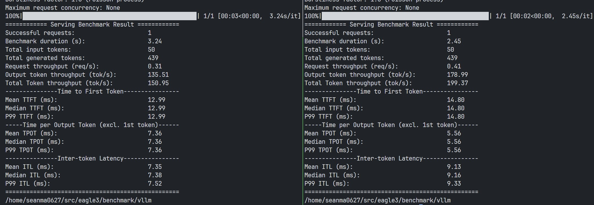
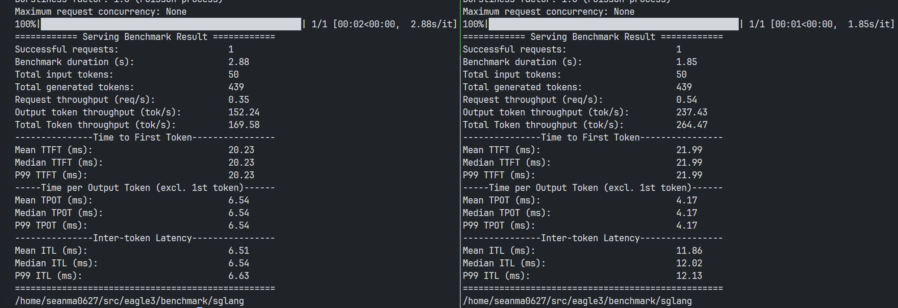
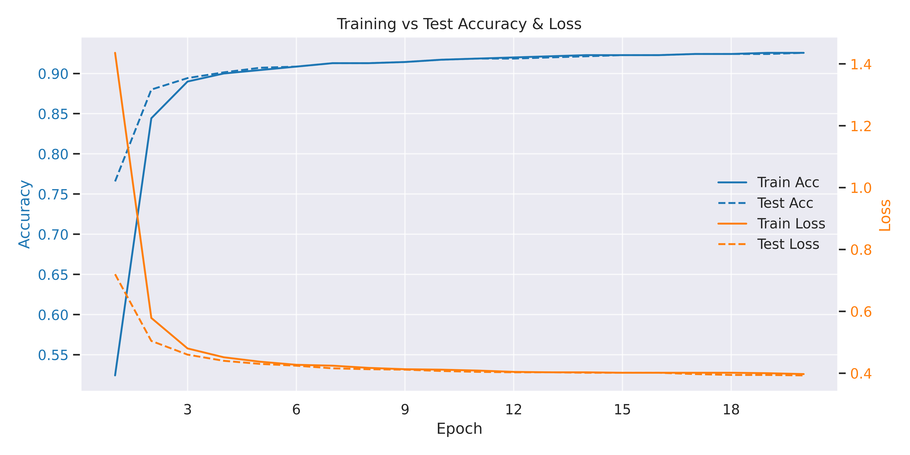

# Eagle3 Training Code Repo

> [!Note]
> - License in `traineagle3` directory: Apache 2.0 (same as the [original eagle repo](https://github.com/SafeAILab/EAGLE))
> - License everywhere else: MIT

## Benchmarks

- **`vllm`: Baseline/Eagle3**
  
  Above benchmark was ran with [this benchmarking file](https://github.com/vllm-project/vllm/blob/main/benchmarks/benchmark_serving.py) and these settings:

  - A single H100 GPU
  - `dtype`: `float16`
  - `attention-backend`: `flashinfer`
  - `speculative_config`:
    - `method`: `eagle3`
    - `draft_tensor_parallel_size`: `1`
    - `num_speculative_tokens`: `2`
  - `num_prompts`: `1`

  - **Lhs**: Baseline
  - **Rhs**: Eagle3
  - Achieving around **1.32x** bump in inferencing speed

- **`sglang`: Baseline/Eagle3**
  
  Above benchmark was ran with [this benchmarking file](https://github.com/vllm-project/vllm/blob/main/benchmarks/benchmark_serving.py) and these settings:
  - A single H100 GPU
  - `dtype`: `float16`
  - `attention-backend`: `flashinfer`
  - `mem-fraction-static`: `0.8`
  - `max-total-tokens`: `131072`
  - `cuda-graph-max-bs`: `32`
  - speculative decoding related:
    - `speculative-algorithm`: `EAGLE3`
    - `speculative-num-steps`: `3`
    - `speculative-eagle-topk`: `24`
    - `speculative-num-draft-tokens`: `128`
  - `num_prompts`: `1`

  - **Lhs**: Baseline
  - **Rhs**: Eagle3
  - Achieving around **1.56x** bump in inferencing speed

> [!Note]
> The models on `huggingface` are the `state_19` (20th epoch). It was trained on 6 H200 GPUs for around 48 hrs (1 epoch took around 2h10m).

- Train/Test Losses/Acc:
  

## Inference Setup (docker/singularity)

> 2 eagle3 model weights on huggingface for `vllm` and `sglang` are identical, the only difference is the `config.json`.

### `vllm`

- Download Eagle3 Model weights from [huggingface](https://huggingface.co/seanmamasde/taide-eagle3-vllm) (you will need to accept the terms on huggingface first before you can download it).

- Pull the [vllm-openai image from dockerhub](https://hub.docker.com/r/vllm/vllm-openai/tags):
  ```bash
  $ docker pull vllm/vllm-openai:latest
  ```
- Or if you're on HPC, you might want to build the singularity image:
  ```bash
  $ singuarity build --fakeroot vllm.sif vllm.def
  ```
- Start the server using the script `benchmark/vllm/serve.sh` (some modifications are necessary to adapt to your environment).

- Run the benchmark using `benchmark/vllm/benchmark.sh` (you will need to clone `vllm` repo to the project root first).

### `sglang`

- Download Eagle3 Model weights from [huggingface](https://huggingface.co/seanmamasde/taide-eagle3-sglang) (you will need to accept the terms on huggingface first before you can download it).

- Pull the [sglang image from dockerhub](https://hub.docker.com/r/lmsysorg/sglang/tags):
  ```bash
  $ docker pull lmsysorg/sglang:latest
  ```
- Or if you're on HPC, you might want to build the singularity image:
  ```bash
  $ singuarity build --fakeroot sglang.sif sglang.def
  ```
- Start the server using the script `benchmark/sglang/serve.sh` (some modifications are necessary to adapt to your environment).

- Run the benchmark using `benchmark/sglang/benchmark.sh` (you will need to clone `vllm` repo to the project root first).

## Training Setup (deepspeed)

```bash
# you will need to accept the terms on huggingface first before you can download it
$ huggingface-cli download seanmamasde/sharegpt-gpt4-taide --local-dir dataset/sharegpt-taide

# install required packages using pip/conda or other package manager of your choice
$ pip install -r requirement.txt

# cd into the directory and change necessary stuff in the config
$ cd traineagle3/llama
$ vim ds_config.json

# start training using deepspeed
$ deepspeed main.py --deepspeed_config ds_config.json
```
